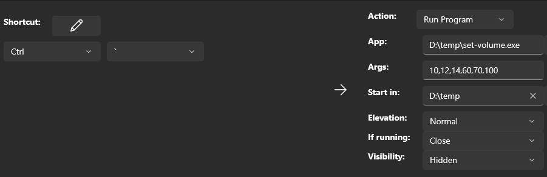

# Set volume

Small console app that can set the current system volume.

I was tired of switching the volume from "music values" to "meeting values". The music values for me a low 10-12% but meeting values are higher 70-90%.

Mostly used with [PowerToys](https://learn.microsoft.com/en-us/windows/powertoys/).

## Set single value

`set-volume 25` - set the current volume to 25%
`set-volume 100` - set the current volume to 100% (max)

## Range of values

Possible to pass range of values and the app will set the volume to the closes (higher) value based on the current system value. The range is separated with `:`

if the current volume is `25` then the command below will set it to `60`. `60` is the next bigger number to `25`:

`set-volume 10:12:14:60:70:90`

Having the volume to `60` the same command will set the volume to `70`.
Running it again - `90`.
Running it again `10` - when the current volume is equal or greater than the max value from the list the app will set the volume to the lowest. This way we can loop through pre-defined volume levels with ease.

## PowerToys

The whole idea of this app was to be used with [PowerToys](https://learn.microsoft.com/en-us/windows/powertoys/). In there we can remap shortcut to run a program.

- start `PowerToys`
- choose `Keyboard Manager`
- scroll to `Remap a shortcut` and click on it
- press `+ Add shortcut remapping`
- Choose the desired shortcut from the left side
- on the right side:

  - `Action` - `Run program`
  - `App` - the full path to `set-volume.exe`
  - `Args` - either single value (for example `20`) or range of values to loop separated by `:` (for example `10:12:14:60:70:100`)
  - `Start in` - (not sure its needed but ..) the folder where `set-volume.exe` is located
  - `Elevation` - `Normal`
  - `If running` - `Close`
  - `Visibility` - `Hidden`

    

  - press `OK`

And thats it! (thinking about the screenshot above) if we now start pressing ``Ctrl + ` `` the volume will change between 10 -> 12 -> 14 -> 60 -> 70 -> 100 -> 10 ...
